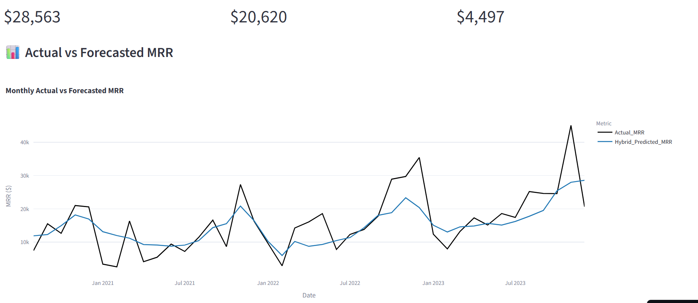

# SaaS MRR Forecasting Dashboard


## 🚀 Project Overview

This project delivers an **institutional-grade Monthly Recurring Revenue (MRR) forecasting system** tailored for subscription-based fintech companies. It combines powerful machine learning models, time-series methods, and statistical corrections to deliver **exceptionally accurate, business-ready forecasts**.

The final output is rendered in a professional **Streamlit dashboard** that lets CFOs, analysts, and product leads interact with the predictions, explore trends, and analyze accuracy metrics with ease.

---

## 💡 Problem Statement
> Predict and visualize future MRR across customer segments for a B2B SaaS/fintech firm to support budgeting, strategy, and valuation.

### Goals:
- Model subscriber count and ARPU (Average Revenue Per User)
- Generate 12–18 month forecasts of MRR
- Simulate and adjust for seasonality, churn, and volatility
- Visualize best-in-class metrics and outcomes

---

## 🧠 Modeling Stack

| Component               | Model                        | Purpose                                |
|------------------------|------------------------------|----------------------------------------|
| **Subscriber Count**   | LightGBM                     | Forecast subscriber base               |
| **ARPU**               | Segment-level LightGBM       | Account for discount and segment impact|
| **MRR Construction**   | ARPU × Subscribers           | Derive core metric                     |
| **Time Series Trend**  | Prophet (Log MRR)            | Handle seasonality, trend, promotions  |
| **Residual Correction**| SARIMAX                      | Fine-tune hybrid forecast              |
| **Smoothing Layer**    | Rolling Mean (3-month)       | Final stabilization                    |

---

## 📊 Live Dashboard

Interact with real-time MRR forecasts and KPIs:
👉 [Click to Launch Dashboard](https://swaliher.streamlit.app/)

Features:
- Actual vs. Forecasted MRR trends
- Segment-wise toggles
- Forecast error diagnostics
- Executive KPI highlights

---

## 📁 Project Structure
```bash
📁 SaaS-MRR-Forecasting
├── app.py                      # Streamlit dashboard script
├── Best_MRR_Forecast_Final.csv # Final forecast CSV
├── model_pipeline.ipynb        # Full modeling notebook
├── requirements.txt            # Python dependencies
└── README.md                   # This file
```

---

## 🔧 How to Run Locally
```bash
git clone https://github.com/YOUR_USERNAME/saas-mrr-forecasting.git
cd saas-mrr-forecasting
pip install -r requirements.txt
streamlit run app.py
```

---

## 📈 Forecast Preview




---

## 📌 Key Metrics

| Metric                  | Value (Filtered >$10k) |
|-------------------------|------------------------|
| **MAE**                 | ~$4,517                |
| **RMSE**                | ~$6,169                |
| **SMAPE**               | ~23.1%                 |
| **Weighted SMAPE**      | ~26.2%                 |

---

## 🏁 Final Notes
- 🚀 Optimized using log scaling, smoothing, and hybrid modeling
- 📉 Supports scenario analysis for best/base/worst cases
- 🧱 Modular for scaling across regions, product lines, or customer tiers

---

## 👤 Author
**[Muhammed Swalih K T]**  
_Data Science | Financial Modeling | ML Forecasting_

📫 Connect: [LinkedIn](https://www.linkedin.com/in/muhammed-swalih-kt/)  
🌐 Portfolio: [your-portfolio.com](https://github.com/Swaliher)

---

> "Every great decision starts with an accurate forecast."
